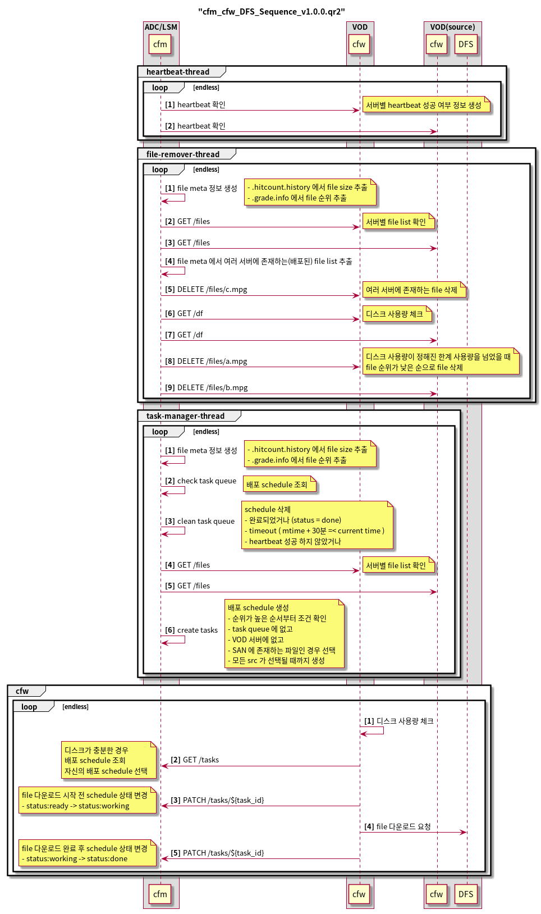
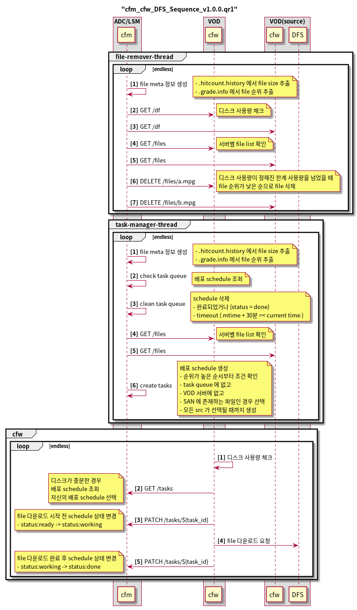
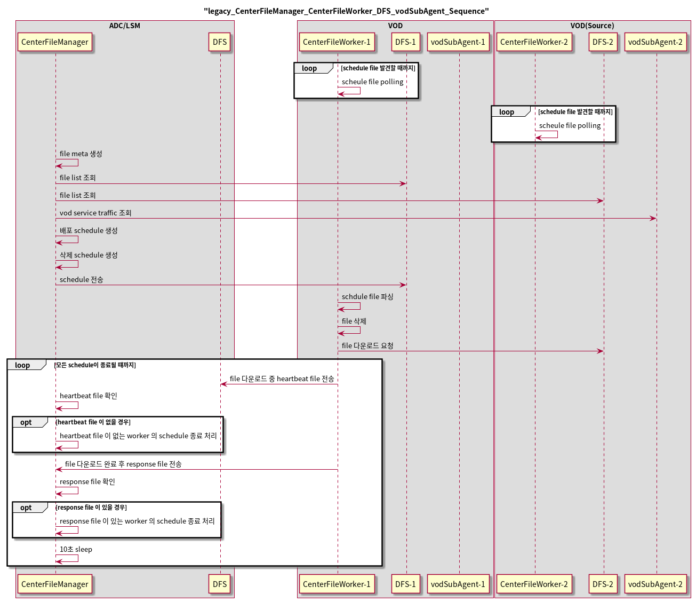

v1.0.0.qr2 / 2020-01-08
===================
cfm, cfw, DFS

- 배포 schedule과 task는 같은 의미로 사용됨
- cfw 와 heartbeat 추가
- 여러 서버에 배포된 파일을 한 서버에만 남기고 나머지에서는 제거하는 기능 추가

  
v1.0.0.qr1 / 2019-11-12
===================
cfm, cfw, DFS

- 배포 schedule과 task는 같은 의미로 사용됨

  
기존 모듈간의 Seqence Diagram
===================
* CenterFileManager, CenterFileWorker, DFS, vodSubAgent

