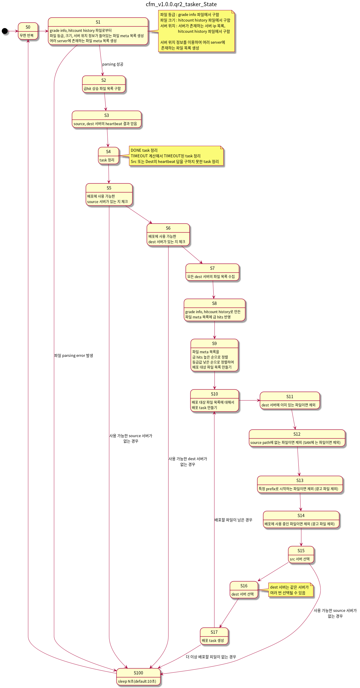

v1.0.0.qr2 / 2020-01-23
===================

### cfm, cfw, DFS

- 배포 schedule과 task는 같은 의미로 사용됨
- cfw 와 heartbeat 추가
- 여러 서버에 배포된 파일을 한 서버에만 남기고 나머지에서는 제거하는 기능 추가

  

### tasker
- task 관리 모듈

### remover

- 파일 삭제 요청 모듈

  
v1.0.0.qr1 / 2019-11-12
===================

### cfm, cfw, DFS

- 배포 schedule과 task는 같은 의미로 사용됨

### tasker

- task 관리 모듈

### remover

- 파일 삭제 요청 모듈

  
기존 모듈간의 Seqence Diagram
===================

### CenterFileManager, CenterFileWorker, DFS, vodSubAgent

