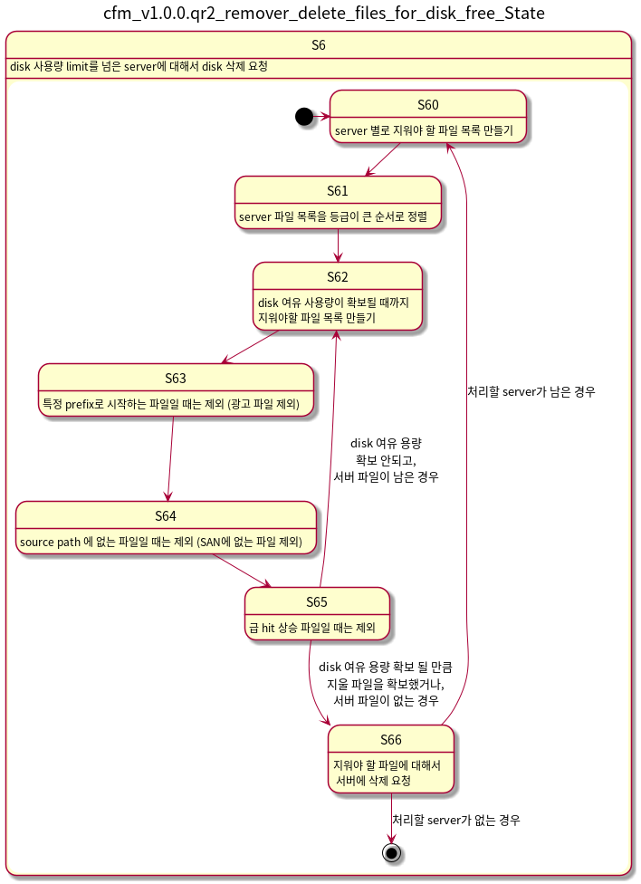

v1.0.0.qr3 / 2020-02-14
===================
### cfm

- cfm 구조 변경
  - remover, tasker thread 하나로 합침
  - .hicount.history, .grade.info 파일 감시 모듈 추가

##### AS-IS:

##### TO-BE:

### cfm, cfw, DFS

- cfm 구조 변경
  - remover, tasker thread 하나로 합침
  - .hicount.history, .grade.info 파일 감시 모듈 추가

### manager

- watcher, runner 관리 모듈
- 파일 시스템의 notify 기능을 test 해보고 지원하는 경우,
  watcher를 notify 모드로, 그렇지 않은 경우 poll 모드로 실행
- watcher에서 알 수 없는 error가 난 경우, poll 모드로 실행
  - watcher poll 모드에서는 error 응답을 하지 않음

### runner

- remove, tasker 작업 실행 모듈

v1.0.0.qr2 / 2020-01-23
===================

### cfm, cfw, DFS

- 배포 schedule과 task는 같은 의미로 사용됨
- cfw 와 heartbeat 추가
- 여러 서버에 배포된 파일을 한 서버에만 남기고 나머지에서는 제거하는 기능 추가

  

### tasker
- task 관리 모듈

### remover

- 파일 삭제 요청 모듈

  
v1.0.0.qr1 / 2019-11-12
===================

### cfm, cfw, DFS

- 배포 schedule과 task는 같은 의미로 사용됨

### tasker

- task 관리 모듈

### remover

- 파일 삭제 요청 모듈

  
기존 모듈간의 Seqence Diagram
===================

### CenterFileManager, CenterFileWorker, DFS, vodSubAgent

